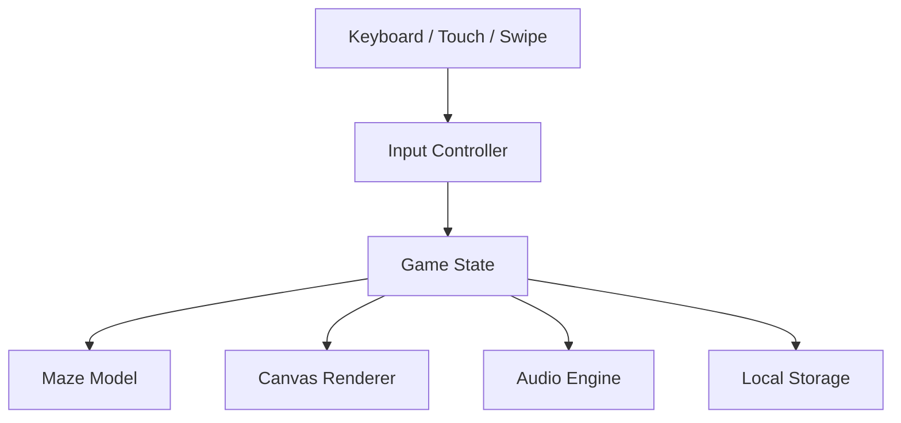

# Architecture Design

This document details the software architecture of **Pixel Maze (p-maze)**.

## System Overview

Pixel Maze is a client-side procedural game written in strict TypeScript and HTML5. It has zero external game engine or UI framework dependencies.

The architecture is divided into clear logical layers:

1. **Core Application**: Coordinates UI screen visibility, settings events, and the primary update loop.
2. **State & Progress**: Tracks position state, level difficulty configs, and localStorage persistence.
3. **Maze Logic**: Generates perfect grids and runs breadth-first pathfinding solvers.
4. **Input Management**: Unifies keyboard repeat timings, swipes, and touch holds into a common command format.
5. **Procedural Audio**: Lazily synthesizes chiptunes and retro sound effects using Web Audio API nodes.
6. **Rendering**: Centers grid drawing and handles double-buffered canvas frames at 60 FPS.

## Data Flow Diagram

## Key Modules

### 1. Game State (`src/game/GameState.ts`)

The central state machine managing player coordinates, screen visibility (`start`, `playing`, `paused`, `completed`), visual transition values (e.g. `moveProgress`, `bumpProgress`), and auto-hint timelines.

### 2. Sizing Config (`src/game/levelConfig.ts`)

Contains procedural level difficulty formulas (mapping levels to dimensions, capping at 21x21, and settings auto-hint inactivity thresholds).

### 3. Input Controller (`src/input/InputController.ts`)

Normalizes keyboard mappings (Vim HJKL, WASD, Arrow keys) and touch screen events (D-pad presses, holds, and swipes) into a single event receiver. Features an OS-independent keyboard repeat delay (200ms initial, 110ms subsequent).

### 4. Audio Engine (`src/audio/AudioEngine.ts`)

Creates a lazy `AudioContext` triggered by user interactions. Utilizes a lookahead step scheduler to synthesize triangle basslines, square leads, and noise hi-hats/snares without loading heavy static media files.

### 5. Canvas Renderer (`src/rendering/CanvasRenderer.ts`)

Implements high-DPI scaling (`devicePixelRatio`) and coordinates:

- A **Static Layer Canvas**: Drawn once on level load/resize to render background floors, starting cells, and walls.
- A **Dynamic Layer Canvas**: Rendered via `requestAnimationFrame` to animate player positions, eye blinking, pulsing exit circles, breadcrumbs, and floating ambient particles.

### 6. Storage (`src/storage/ProgressStorage.ts`)

Manages reading/writing from local storage, running versioned schema migrations, and checking values against default configurations.

## Key Design Tradeoffs

1. **Framework-free vs. Framework**: Writing vanilla HTML and CSS allows the game to remain extremely lightweight (< 30KB bundle size), fast, and ideal for educational review. Since gameplay is Canvas-based, a UI framework like React would only add runtime overhead and bundle size without solving rendering tasks.
2. **Double-layered Canvas**: Splitting static wall layouts from dynamic player movements eliminates heavy pixel redraw costs, reducing mobile CPU/GPU loads and saving battery life.
3. **Procedural Web Audio vs. MP3 Files**: Generating sounds in code avoids downloading large asset files, keeps initial loading instantaneous, and enables infinite procedural musical variations on every level.
